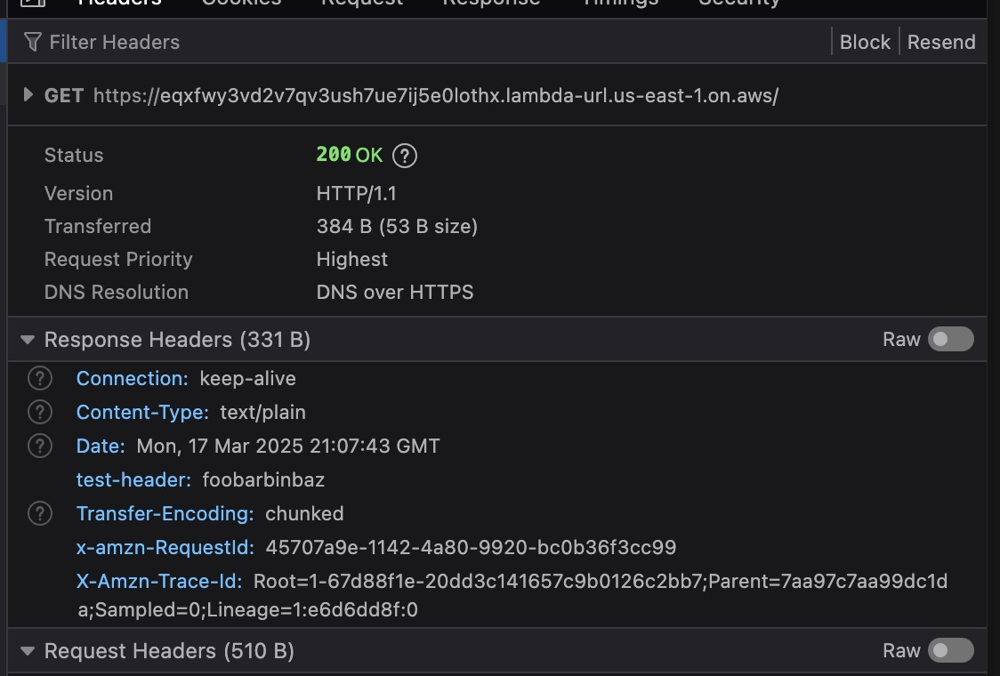

# Bug Reproduction of setCookie Streaming Lambdas

It appears that `setCookie(...)` from `h3` is not working when deploying to `aws-lambda` preset with `awsLambda.streaming: true`

## Setup

nitro.config.js:

```js
export default defineNitroConfig({
  srcDir: 'server',
  preset: 'aws-lambda',

  awsLambda: {
    streaming: true,
  },

  compatibilityDate: '2025-03-17',
})
```

function code

```ts
import { setCookie, setHeader } from 'h3'

export default defineEventHandler((event) => {
  setCookie(event, 'test', 'foobarbinbaz')
  setHeader(event, 'content-type', 'text/plain')
  setHeader(event, 'test-header', 'foobarbinbaz')
  return 'Start by editing <code>server/routes/index.ts</code>.'
})
```

deployment with sst

```ts
export default $config({
  app(input) {
    return {
      name: 'nitro-app',
      removal: input?.stage === 'production' ? 'retain' : 'remove',
      protect: ['production'].includes(input?.stage),
      home: 'aws',
    }
  },
  async run() {
    new sst.aws.Function('TestFunction', {
      handler: '.output/server/index.handler',
      streaming: true,
      url: true,
    })
  },
})
```

No `set-cookie` header is present


## reproduction

> NOTE: I have this already deployed here to get a quick peek
> [https://eqxfwy3vd2v7qv3ush7ue7ij5e0lothx.lambda-url.us-east-1.on.aws](https://eqxfwy3vd2v7qv3ush7ue7ij5e0lothx.lambda-url.us-east-1.on.aws)

1. make sure you've got `aws-cli` installed and authenticated with a lambda account
1. `bun run build && bun sst deploy`
1. repeat after you make changes
1. cleanup resources with `bun run remove`
